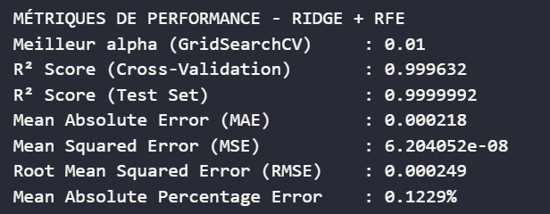
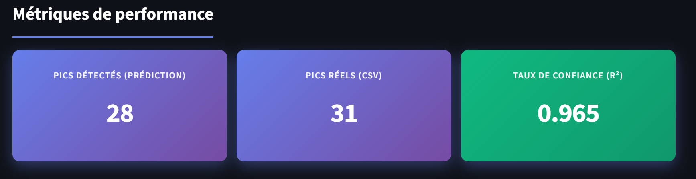
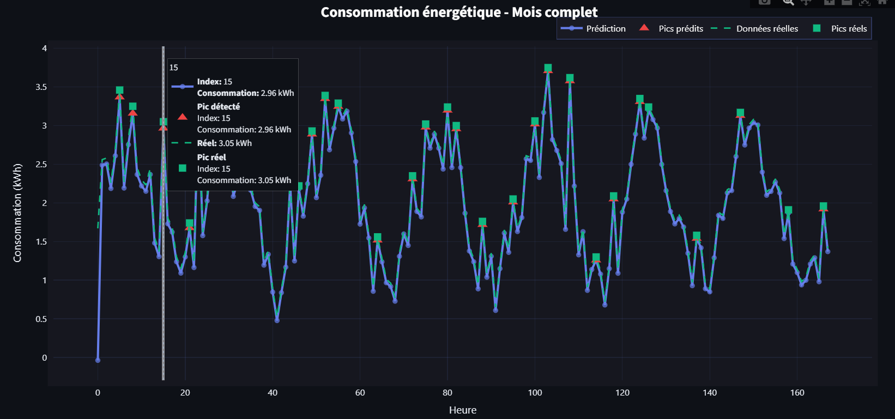

#  Prédiction de Consommation Énergétique en kWh et Détection des Heures de Pic

> **Projet de Machine Learning** | Prédiction intelligente de la consommation électrique des bâtiments résidentiels marocains et détection des heures de pic

[](https://www.python.org/downloads/)
[](https://opensource.org/licenses/MIT)
[](https://streamlit.io/)

---


## Notre projet

Ce projet développe un **système de prédiction de consommation énergétique** basé sur le machine learning pour les bâtiments résidentiels marocains. Il combine :

**Prédiction régressive** : Prédire la consommation électrique (kWh) avec haute précision  
**Détection de pics** : Identifier les heures critiques de surcharge énergétique  
**Interface intuitive** : Application Streamlit pour visualisation et interaction  
**Données réelles** : Dataset MORED (12 bâtiments marocains)  

**Objectifs principaux** :
- Optimiser la gestion du réseau électrique
- Réduire les coûts énergétiques pour les consommateurs
- Planifier les ressources énergétiques de manière efficace
- Faciliter la transition énergétique vers les énergies renouvelables

---

## Contributeurs


- **MELLAK Khadija** 
- **ABARKI Aya**
- **BENSAID Malak**

**École** : Ecole Nationale des Sciences Appliquées de Fès (ENSAF)  
**Filière** : Ingénierie Logicielle et Intelligence Artificielle  
**Année** : 2024-2025

---

### Étapes d'installation

1. **Cloner le dépôt**

```bash
git clone https://github.com/1marieCurie/Energy_consumption_and_peaks_detection.git
cd Energy consumption and peaks detection
```

2. **Télécharger les données MORED**

Les données du projet sont stockées sur Google Drive. **Téléchargez-les et importez-les dans le dossier du projet** :

🔗 **[Lien Google Drive - DONNÉES DU PROJET](https://drive.google.com/drive/folders/1yCS3exjM_gOe4efNLF2s3LM3uP2bH281?usp=sharing)**

**Contenu à télécharger** :
- `data/` - Dataset complet + métadonnées
- `Energy consumption and peaks detection/` - Modèles entraînés (.pkl)


**Instructions téléchargement** :
```bash
# Après avoir téléchargé le dossier Google Drive:
# 1. Décompressez le fichier ZIP
# 2. Copiez les dossiers dans votre répertoire cloné
# Structure finale attendue:
Energy_consumption_and_peaks_detection/
├── data/
│   ├── metadata/
│   └── premises_data/
└── screens/
    ├── mored_overview.png
    ├── model_performance.png
    └── ...

│   ├── project_lab.ipynb # lab principale de projet
│   ├── Application/
│       └── app.ipynb #notebook principale de l'application
│       └── app.py #script généré automatiquement à partir l'exécution de fichier .app.ipynb
│       └── sample_input_v2.csv
│       └── sample_input.csv  # deux fichiers csv pour importer dans l'application et valider les performances de modèle

│   └── requierments.txt # fichiers des dépendances à installer


---

## Utilisation

### Lancer l'Application Streamlit

```bash
streamlit run app.py
```

L'application s'ouvrira automatiquement dans votre navigateur à `http://localhost:8501`

### Utiliser l'Application

#### 1. **Importer vos données**
   - Téléchargez un fichier CSV contenant les colonnes requises :
     - `year`, `month`, `day_of_week`, `hour`, `is_weekend`, `n_occupants`, `is_peak`
     - (Optionnel) `y_kWh` : consommation réelle pour comparaison

#### 2. **Visualiser les prédictions**
   - Consultez les graphiques interactifs avec :
     - Vue par jour, semaine ou mois
     - Détection automatique des pics
     - Comparaison réel vs prédiction

#### 3. **Analyser les métriques**
   - Taux de confiance (R²)
   - Erreur moyenne (MAE)
   - Pics détectés (nombre et heures)

#### 4. **Exporter les résultats**
   - Téléchargez les prédictions en CSV

---

##  Architecture du Projet

```
Energy_consumption_and_peaks_detection/
├── app.py                          # Application Streamlit principale
├── clean_notebook.ipynb            # Notebook complet (EDA + Entraînement)
├── requirements.txt                # Dépendances Python
├── README.md                       # Ce fichier

├── scaler.pkl                 # Normaliseur StandardScaler
├── selector.pkl               # Sélecteur RFE (20 features)
├── selected_features.pkl      # Liste des 20 features optimales
├── ridge_model.pkl            # Modèle Ridge entraîné
├── data/
│   ├── final_dataset/
│   │   └── data.csv              # Dataset complet (12 bâtiments)
│   ├── preprocessing_results/     # Résultats du preprocessing 1
    ├── preprocessing_results_2/   # Résultats du preprocessing 2 (suite)
│   ├── metadata/                  # Fichiers YAML des métadonnées
│   └── premises_data/             # Données brutes
└── screens/
    ├── mored_overview.png         # Présentation dataset MORED
    ├── models_performance.png     # Comparaison modèles
    ├── best_model.png             # modèle avec la meilleur performance
    ├── streamlit_dashboard.png    # Aperçu application
    └── peak_detection.png         # Détection pics
```

---

## Dataset MORED


### Caractéristiques du Dataset

| Aspect | Détails |
|--------|---------|
| **Nom complet** | Moroccan Buildings' Electricity Consumption Dataset |
| **Nombre de bâtiments** | 12 résidentiels |
| **Villes couvertes** | Salé, Tétuan, Rabat |
| **Durée d'acquisition** | 14-90 jours par bâtiment |
| **Taux d'échantillonnage** | 1/5 à 1/10 secondes (5-10 mesures/sec) |
| **Granularité** | 10-20 secondes par mesure |
| **Consommation quotidienne** | 28-295 kWh |
| **Type de données** | WP (Whole Premises - consommation totale) |

### Métadonnées Incluses

- Nombre d'occupants (1-8)
- Type de logement (appartement, maison)
- Surface habitable (50-103 m²)
- Statut de propriété (location vs propriété)
- Composition démographique

### Références

- [Site officiel MORED](https://moredataset.github.io/MORED/)
- [Dépôt GitHub MORED](https://github.com/MOREDataset/MORED)
- [Publication scientifique](https://doi.org/10.3390/en13246737)

---

## Modèle et Performance


### Approches Testées


### Modèle Final : Ridge + RFE (20 features)



### Features Sélectionnées (Top 20)

Les 20 features les plus importantes identifiées par RFE :

1. `y_kWh_lag1` - Consommation précédente (1h)
2. `y_kWh_lag2` - Consommation précédente (2h)
3. `lag_24` - Consommation 24h avant
4. `lag_48` - Consommation 48h avant
5. `lag_336` - Consommation 7 jours avant
6. `rolling_24h` - Moyenne glissante 24h
7. `rolling_7d` - Moyenne glissante 7 jours
8. `expanding_mean` - Moyenne cumulative
9. `expanding_std` - Écart-type cumulatif
10. `hour` - Heure du jour
11. `is_peak` - Flag heures de pointe
12. `hour_day_interaction` - Interaction heure × jour semaine
13. `hour_sin` / `hour_cos` - Cyclicité heure (sin/cos)
14. `dow_sin` / `dow_cos` - Cyclicité jour semaine
15. `month_sin` / `month_cos` - Cyclicité mensuelle
16. `n_occupants` - Nombre d'occupants
17. `rolling_6h` - Moyenne glissante 6h
18-20. Autres statistiques de variation

### Raison du Succès

- **Features temporelles riches** : Lags courts et longs capturent la dépendance séquentielle
- **Cyclicité encodée** : Sin/cos évitent l'ordre linéaire erroné des heures/jours
- **Régularisation** : Ridge évite l'overfitting malgré 20 features
- **Sélection RFE** : Élimine le bruit, garde les plus informatifs

---

## Fonctionnalités Principales

### **Tableau de Bord Interactif**



- Graphiques interactifs Plotly
- Filtres par jour/semaine/mois
- Visualisation temps réel
- Comparaison réel vs prédiction


### **Détection de Pics Intelligente**



- Détection automatique des heures critiques
- Comparaison pics réels vs prédits
- Prédiction par heure ou jour
- Confiance de prédiction (R²)
- Erreur moyenne (MAE)
- Historique des prédictions

### **Export des Résultats**

- Télécharge CSV avec prédictions
- Intégration avec Excel/Power BI
- Historique prédictions conservé

---


### Cas d'Usage Validés

✅ Prédiction consommation horaire  
✅ Détection heures de pointe  
✅ Prédiction charge moyenne  

---

## Utilisation Locale

Le fichier `requirements.txt` inclus dans le projet contient toutes les dépendances nécessaires pour la mise en oeuvre et la construction de modèle et de l'application Streamlit.


```bash
pip install -r requirements.txt
```

### Versions Testées

- Python 3.8, 3.9, 3.10, 3.11
- Streamlit 1.28+
- Scikit-learn 1.3+

### Charger vos données

1. Préparer un CSV avec colonnes :
   - `year`, `month`, `day_of_week`, `hour`, `is_weekend`, `n_occupants`, `is_peak`
   - (Optionnel) `y_kWh` pour comparaison

2. Cliquer sur "Importer vos données" dans l'app, en particulier vous pouvez utiliser les fichiers `sample_input.csv` et `sample_input_v2.csv` pour faire une démonstration.

3. Visualiser prédictions et pics

4. Télécharger résultats en CSV

---

## 🔬 Reproduire l'Analyse Complète

Pour rejouer tout le pipeline (nettoyage → features → entraînement) :

```bash
# Ouvrir le notebook
jupyter notebook project_lab.ipynb

# Exécuter toutes les cellules dans l'ordre:
# 1. Exploration données
# 2. Nettoyage & prétraitement
# 3. Feature engineering
# 4. Entraînement modèles
# 5. Évaluation & stacking
# 6. Sauvegarde modèle final

```

## Remerciements

- **MORED Dataset** : TICLab UIR et USAID (PVBuild)
- **Mme Chougrad Hiba** : Enseignante chercheure à ENSA Fès et encadrante de projet


## Ressources Supplémentaires

-  [Documentation Streamlit](https://docs.streamlit.io/)
-  [Scikit-learn ML Guide](https://scikit-learn.org/)
-  [Timeseries Forecasting Best Practices](https://machinelearningmastery.com/)

